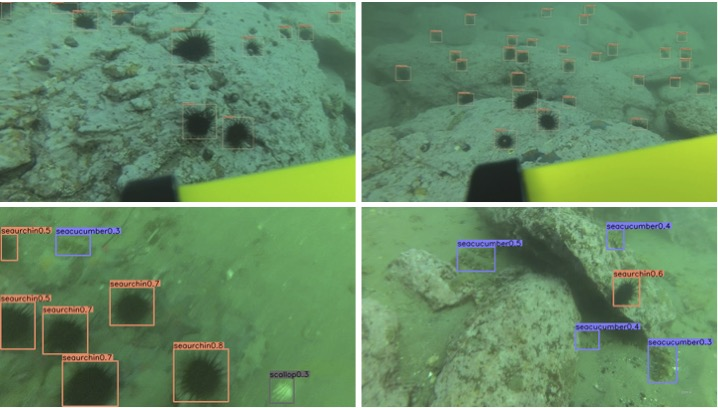

# UDD_OFFICIAL

To promote the development of underwater robot picking in sea farms,
we propose an underwater open-sea farm object detection dataset called UDD. 
Concretely, UDD consists of 3 categories (seacucumber, seaurchin, and scallop) 
with 2,227 images. To the best of our knowledge, it's the first dataset collected 
in a real open-sea farm for underwater robot picking and we also propose a novel
Poisson-blending-embedded Generative Adversarial Network (Poisson GAN) to overcome 
the class-imbalance and massive small objects issues in UDD. By utilizing Poisson GAN
to change the number, position, even size of objects in UDD, we construct a large 
scale augmented dataset (AUDD) containing 18,000 images. Besides, in order to make the 
detector better adapted to the underwater picking environment, a dataset (Pre-training 
dataset) for pre-training containing 590,000 images is also proposed. 
## Download

* [BaiduYun](https://pan.baidu.com/s/1byq7wEID-OzLSJ8p5A6Z5g) Key : 2kse

## Citation 

@article{Wang:2020ug,
author = {Wang, Zhihui and Liu, Chongwei and Wang, Shijie and Tang, Tao and Tao, Yulong and Yang, Caifei and Li, Haojie and Liu, Xing and Fan, Xin},
title = {{UDD: An Underwater Open-sea Farm Object Detection Dataset for Underwater Robot Picking}},
journal = {arXiv.org},
year = {2020},
eprint = {2003.01446v1},
eprinttype = {arxiv},
eprintclass = {cs.CV},
month = mar,
annote = {10 pages, 9 figures}
}

